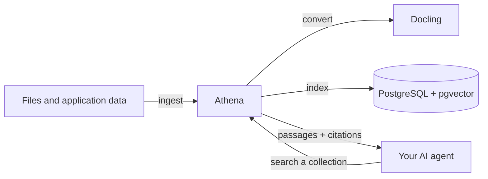

# Athena

Athena is the document and retrieval engine for your AI agents. Give it files
or application data, then ask it for grounded passages and citations your agent
can use to answer with confidence.



## Capabilities

- Ingest application data, crawler output, exports, and custom integrations as text.
- Upload PDF, Word, PowerPoint, Excel, HTML, text, and Markdown files.
- Search isolated collections with hybrid or vector retrieval.
- Return passages with source, page, and section citations when available.
- Keep originals available to authenticated applications and viewers.

## Get Running

Athena's default Docker Compose stack includes PostgreSQL with pgvector and
Docling, so PDF and Office support are ready from the first start. Docling's CPU
image is about 4.4 GB, so the initial pull can take a few minutes.

```bash
git clone https://github.com/thehapyone/athena.git
cd athena
cp .env.example .env
# Set ATHENA_API_TOKEN and your embedding-provider credentials in .env.
docker compose up -d --build
```

When the stack is healthy, Athena is available at `http://127.0.0.1:8080`.
Explore the interactive API at `http://127.0.0.1:8080/docs`.

## Give Your Agent Knowledge

First, set the API token from `.env`:

```bash
export ATHENA_TOKEN='the ATHENA_API_TOKEN value from .env'
```

Send an application-owned record:

```bash
curl -sS -X POST http://127.0.0.1:8080/v1/documents/text \
  -H "Authorization: Bearer $ATHENA_TOKEN" \
  -H 'Content-Type: application/json' \
  -d '{
    "collection_id": "support",
    "external_id": "returns-policy",
    "title": "Returns policy",
    "source_uri": "https://example.com/returns",
    "text": "Customers can return unused items within 30 days."
  }'
```

Or upload a document:

```bash
curl -sS -X POST http://127.0.0.1:8080/v1/documents/file \
  -H "Authorization: Bearer $ATHENA_TOKEN" \
  -F collection_id=support \
  -F file=@./returns-policy.pdf
```

Both calls return a `job_id`. Poll `GET /v1/jobs/{job_id}` until it completes,
then let your agent retrieve relevant context:

```bash
curl -sS -X POST http://127.0.0.1:8080/v1/search \
  -H "Authorization: Bearer $ATHENA_TOKEN" \
  -H 'Content-Type: application/json' \
  -d '{
    "collection_ids": ["support"],
    "query": "How long do customers have to return an item?"
  }'
```

## Bring Your Own Sources

Athena accepts two inputs: normalized text and uploaded files. That makes it
easy to connect the systems your agent already uses.

| Your source | Send to Athena |
| --- | --- |
| Database records, SaaS exports, web crawlers, or custom connectors | `POST /v1/documents/text` |
| Local and application-uploaded documents | `POST /v1/documents/file` |
| PDF, Word, PowerPoint, Excel, and HTML | File upload; the included Docling service converts them. |

Athena does not bundle direct connectors for S3, Google Drive, Notion, GitHub,
or websites. Keep source-specific authentication and sync logic with the owning
application, then send the resulting text or files to Athena.

## Next Steps

- See the interactive API reference at `/docs` on your running Athena instance.
- Read the [API Reference](docs/api.md) for supported endpoints and requests.
- Read [Architecture](docs/architecture.md) for deployment, configuration, and
  lifecycle details.
- Read [Contributing](CONTRIBUTING.md) for local development.

Athena is released under the [MIT License](LICENSE).
